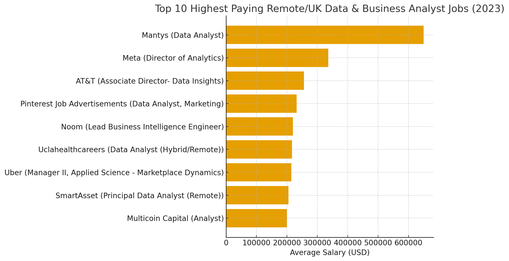
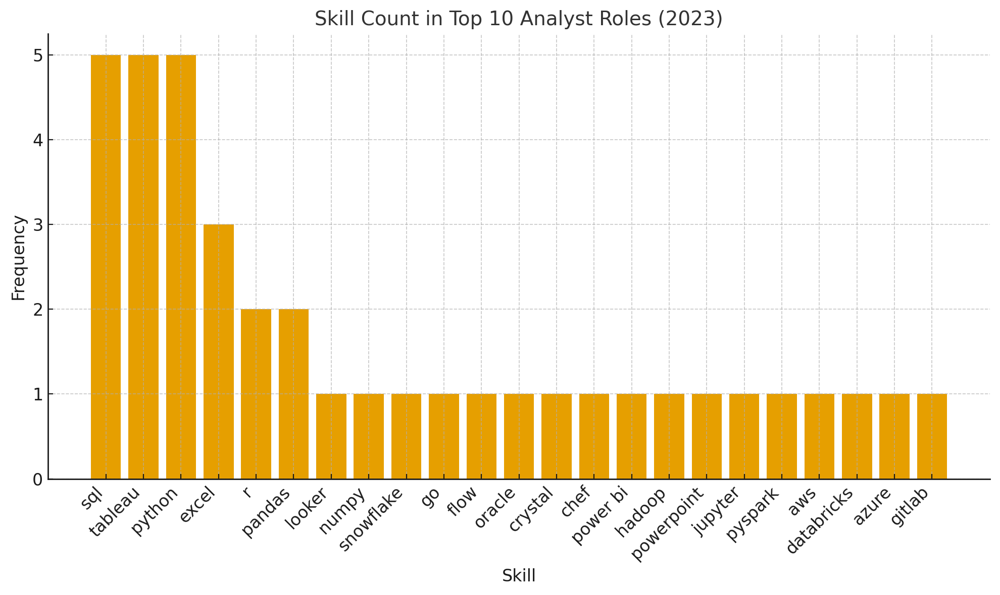

# Introduction
📊 This project dives into the data job market with a focus on Data Analyst and Business Analyst roles.
💼 It explores the top-paying jobs, highlights the most in-demand skills, and reveals where high demand meets high salary in the field of data analytics.
🚀 The goal is to provide insights for aspiring analysts, career switchers, and professionals looking to understand the evolving landscape of data-driven careers.

SQL queries? Check them out here [project_sql folder](/project_sql/).

# Background
✨ Driven by a desire to navigate the data analytics job market more effectively, this project was created to identify top-paying and in-demand skills, while streamlining research to help others find the most optimal jobs.

📂 Data was sourced from [SQL Course](https://lukebarousse.com/sql). Which provides rich insights into job titles, salaries, locations, postings, and essential skills.

### the questions I wanted to answer through my SQL queries were:

1.  💼 What are the top-paying Business & Data Analyst jobs?

2.  🛠️ What skills are required for these top-paying jobs?

3.  📊 What are the most in-demand skills for these roles?

4.  💰 Which skills are associated with the highest salaries?

5.  🚀 What are the most optimal skills to learn in this area?

# Tools Used
For my deep dive into the Data Analytics job market, I relied on several key tools:

- 🐘 **PostgreSQL** – The chosen database management system, ideal for handling and storing job postings data.

- 📝 **SQL** – The backbone of my analysis, enabling me to query the database and uncover critical insights.

- 💻 **Visual Studio Code** – My go-to editor for database management and executing SQL queries.

- 🌐 **Git & GitHub** – Essential for version control and sharing SQL scripts and analysis, ensuring collaboration and project tracking.

# The Analysis
Each Query for this project aimed at investigating specific aspects of the Data Anlalytics job market. Here's how I apporached each question:

### 1. Top-paying Business & Data Analyst jobs
to indentify the highest- paying roles I filtered data analyst positions by average yearly salary and location, focusing on remote jobs. This query highlights the high paying oppurtunities in the field.

``` sql
SELECT
    job_id,
    job_title,
    job_location,
    job_schedule_type,
    salary_year_avg,
    job_posted_date,
    company_dim.name AS company_name
FROM    
    job_postings_fact
LEFT JOIN company_dim ON job_postings_fact.company_id = company_dim.company_id
WHERE   
    (job_title_short = 'Data Analyst' OR job_title_short = 'Business Analyst') AND
    (job_location = 'Anywhere' OR job_location = 'United Kingdom') AND
    salary_year_avg IS NOT NULL
ORDER BY 
    salary_year_avg DESC
LIMIT 10
```
 📊 **Key Insights**

💰***Highest Salary Outlier*** 

Mantys – Data Analyst tops the chart with a staggering $650,000/year, far exceeding the others.

This could be due to equity compensation, seniority, or misclassification (worth noting as an outlier).

🏢***Big Tech Presence*** 

High-paying roles are offered by Meta, Uber, AT&T, and Pinterest, showing that large tech firms remain leaders in compensation for analyst-related roles.

📈***Leadership Roles Pay More*** 

Titles with “Director” or “Manager” (Meta, AT&T, Uber) consistently fall in the $200k–$336k range, highlighting how seniority drives salary.

🌍***Remote Flexibility*** 

All jobs are listed as “Anywhere” (remote), indicating that high-paying analyst roles are accessible without geographic restrictions.

⚖️***Specialist vs. Generalist Titles*** 

Generic “Analyst” roles (Multicoin Capital) are at the lower end of this top 10 (~$200k).

More specialized titles like “Data Insights,” “Applied Science,” and “BI Engineer” command significantly higher salaries.


*Bar Graph visualising the salary for the Top 10 Paying salaries for Business/ Data Analyst roles; ChatGPT generated this graph from my SQL query results*


### 2. What skills are required for the top-paying jobs
To identify what the most useful skills are for the top paying jobs I used the results from the top paying jobs returned from the first query filtering using skills data the specific skills required for these roles

Why? this provides a detailed overview at which skills are required for these high
paying jobs, helping job seekers understand which skills to develop to allign with the
top salaries 

```sql
WITH top_paying_jobs AS (
    SELECT
        job_id,
        job_title,
        salary_year_avg,
        company_dim.name AS company_name
    FROM    
        job_postings_fact
    LEFT JOIN company_dim ON job_postings_fact.company_id = company_dim.company_id
    WHERE   
        (job_title_short = 'Data Analyst' OR job_title_short = 'Business Analyst') AND
        (job_location = 'Anywhere' OR job_location = 'United Kingdom') AND
        salary_year_avg IS NOT NULL
    ORDER BY 
        salary_year_avg DESC
    LIMIT 10
)

SELECT 
    top_paying_jobs.*,
    skills
FROM 
    top_paying_jobs
INNER JOIN skills_job_dim ON top_paying_jobs.job_id = skills_job_dim.job_id
INNER JOIN skills_dim ON skills_job_dim.skill_id = skills_dim.skill_id
ORDER BY
    salary_year_avg DESC
```

🔍 **Key Insights**

🗄️ ***SQL*** is the #1 must-have skill – it appears in half of these top roles.

🐍 ***Python*** is nearly as important – 40% of the jobs list it, often paired with SQL.

📝 ***BI tools*** (Tableau + Excel) are critical – they appear in 70% of the jobs.

📊 ***R*** is still relevant but less frequent – mostly for analytics-heavy or data science–leaning analyst roles.

💻 ***Cloud/data*** engineering exposure (Azure, Databricks, AWS, Snowflake, Hadoop) is increasingly important at senior/high-paying levels.

🛠️ ***Specialist tools*** (GitLab, Chef, Oracle, PowerPoint, Crystal, Flow) show that some roles need cross-functional skills beyond pure analytics.


*Bar Graph visualising the Top skills associated with high Paying salaries for Business/ Data Analyst roles; ChatGPT generated this graph from my SQL query results*


### 3. What are the most in-demand skills Data Analytics

This query helped identify the skills most frequently requested in job postings, directing focus to areas with high demand.
WHY?? Retrieves the top 5 skills with the highest demand in the job market,
providing insights into the most valuable skills for job seekers.

```sql

SELECT
    skills,
    COUNT(skills_job_dim.job_id) AS demand_count 
FROM job_postings_fact
    
INNER JOIN skills_job_dim ON job_postings_fact.job_id = skills_job_dim.job_id
INNER JOIN skills_dim ON skills_job_dim.skill_id = skills_dim.skill_id
WHERE
    job_title_short = 'Data Analyst' AND
    job_location = 'Anywhere' 
GROUP BY
    skills
ORDER BY 
    demand_count DESC
LIMIT 5
```
📊 **Key Insights**

🗄️***SQL Dominates*** 

With 7,291 mentions, SQL is by far the most in-demand skill.

Confirms that database querying remains the backbone of analyst roles.

📑***Excel Still Matters*** 

Despite newer tools, Excel (4,611 mentions) is still heavily required.

Suggests companies value its accessibility for reporting and analysis.

🐍***Python on the Rise*** 

With 4,330 mentions, Python is almost tied with Excel.

Indicates a shift toward programmatic data analysis, automation, and advanced analytics.

📊***Visualization Tools*** 

Tableau (3,745) and Power BI (2,609) highlight strong demand for data storytelling and dashboarding.

Suggests that analysts must communicate insights visually, not just crunch numbers.

⚖️***Balance of Skills*** 

The mix of foundational (SQL, Excel) and modern (Python, Tableau, Power BI) shows that top analysts need both traditional and technical skills.

**📊 Top 5 In-Demand Skills for Data/Business Analysts (2023)**

| Rank | Skill     | Demand Count |
|------|-----------|--------------|
| 1    | SQL       | 7,291        |
| 2    | Excel     | 4,611        |
| 3    | Python    | 4,330        |
| 4    | Tableau   | 3,745        |
| 5    | Power BI  | 2,609        |


### 4. Skills Based on Salary
Exploring the average salaries associated with different skills revealed which skills are the highest paying.
WHY??? This insight helps indetify the most finacially rewarding skills to aquire or improve.

```sql
SELECT
    skills,
    ROUND (AVG(salary_year_avg), 2) AS average_salary
FROM job_postings_fact
    
INNER JOIN skills_job_dim ON job_postings_fact.job_id = skills_job_dim.job_id
INNER JOIN skills_dim ON skills_job_dim.skill_id = skills_dim.skill_id
WHERE
    job_title_short = 'Data Analyst' 
    AND job_work_from_home = True
AND 
    salary_year_avg IS NOT NULL
GROUP BY
    skills
ORDER BY 
    average_salary DESC
LIMIT 25
```

📊 **Key Insights**

The line between “Data Analyst” and “Data Engineer/Scientist” is blurring

Tools like PySpark, Airflow, Databricks suggest analysts are expected to handle big data pipelines, not just dashboards.

🐍***Python stack dominance***

Pandas, NumPy, Scikit-learn, Jupyter → Python has become the de facto language for high-paying analyst roles, displacing R in top-paying markets.

💻***Cloud-first, DevOps-aware analysts are rare and rewarded***

GitLab/Bitbucket/Jenkins/Kubernetes in an analyst skill list would have been surprising a few years ago.

Shows that modern analysts are expected to collaborate like engineers.

💰***Premium for versatility***

Analysts who can bridge BI, ML, and engineering — moving seamlessly between SQL, Python, cloud, and visualization — stand out and earn higher salaries.


**📊 Top 25 Skills Based on Salary for Data Analytics**
| skills        | average_salary |
|---------------|----------------|
| pyspark       | 208172.25      |
| bitbucket     | 189154.50      |
| couchbase     | 160515.00      |
| watson        | 160515.00      |
| datarobot     | 155485.50      |
| gitlab        | 154500.00      |
| swift         | 153750.00      |
| jupyter       | 152776.50      |
| pandas        | 151821.33      |
| elasticsearch | 145000.00      |
| golang        | 145000.00      |
| numpy         | 143512.50      |
| databricks    | 141906.60      |
| linux         | 136507.50      |
| kubernetes    | 132500.00      |
| atlassian     | 131161.80      |
| twilio        | 127000.00      |
| airflow       | 126103.00      |
| scikit-learn  | 125781.25      |
| jenkins       | 125436.33      |
| notion        | 125000.00      |
| scala         | 124903.00      |
| postgresql    | 123878.75      |
| gcp           | 122500.00      |
| microstrategy | 121619.25      |

### 5. Most Optimal Skills to learn
Combining insights from demand and salary data, This query aimed to pinpoint skills that are both in high demand and have high salaries.
WHY?? - Targets skills that offer jon security (High Demand) as well as financial security (High Pay). Offering strategic insights for career development in data analysis

```sql
WITH skills_demand AS (
SELECT
    skills_dim.skill_id,
    skills_dim.skills,
    COUNT(skills_job_dim.job_id) AS demand_count 
FROM job_postings_fact
    
INNER JOIN skills_job_dim ON job_postings_fact.job_id = skills_job_dim.job_id
INNER JOIN skills_dim ON skills_job_dim.skill_id = skills_dim.skill_id
WHERE
    job_title_short = 'Data Analyst'
AND 
    job_work_from_home = TRUE 
AND 
    salary_year_avg IS NOT NULL
GROUP BY
    skills_dim.skill_id
),  average_salary AS  (
SELECT
    skills_dim.skill_id,
    skills_dim.skills,
    ROUND (AVG(salary_year_avg), 2) AS average_salary
FROM job_postings_fact
    
INNER JOIN skills_job_dim ON job_postings_fact.job_id = skills_job_dim.job_id
INNER JOIN skills_dim ON skills_job_dim.skill_id = skills_dim.skill_id
WHERE
    job_title_short = 'Data Analyst' AND 
    job_work_from_home = True
AND 
    salary_year_avg IS NOT NULL
GROUP BY
    skills_dim.skill_id
)

SELECT
    skills_demand.skill_id,
    skills_demand.skills,
    demand_count,
    average_salary
FROM
    skills_demand
INNER JOIN
    average_salary ON skills_demand.skill_id = average_salary.skill_id
WHERE
    demand_count > 10
ORDER BY
    average_salary DESC,
    demand_count DESC
    
LIMIT 25
```

📊 **Key Insights**

📈***High-Demand Programming Languages:***
Python and R stand out for their high demand, with demand counts of 236 and 148 respectively. Despite the high demand the average salaries for Python is $101,397.22 and $100,498.77 for R, indicating that proficiency in these languages is highly valued but also widely available.

🛠️***Cloud Tools and Tech:***
Skills in specialised technologies such as Snowflake, Azure, AWS and BigQuery show signficant demand with relatively high average salaries, pointing towards the growing importance of clould platforms and Big Data technologies in data analysis.

📊***BI and Visualisation Tools:***
Tableau and Looker, with demand counts of 230 and 49 respectively, and average salaries around $99,287.65 and $103,795.30, highlight the critical role of data visualisation and business intelligence in delivering actionable insights from data.

📑***Database Technologies:***
The demand for skills in traditional and NoSQL databases (Oracle, SQL Server, NoSQL) with average salaries ranging from $97,786 to $104,534, reflects the enduring need for data storage, retrieval, and management expertise.


**📊 Top 25 Optimal Skills to learn for Data Analytics**
| skill_id | skills     | demand_count | average_salary |
|----------|------------|--------------|----------------|
| 8        | go         | 27           | 115319.89      |
| 234      | confluence | 11           | 114209.91      |
| 97       | hadoop     | 22           | 113192.57      |
| 80       | snowflake  | 37           | 112947.97      |
| 74       | azure      | 34           | 111225.10      |
| 77       | bigquery   | 13           | 109653.85      |
| 76       | aws        | 32           | 108317.30      |
| 4        | java       | 17           | 106906.44      |
| 194      | ssis       | 12           | 106683.33      |
| 233      | jira       | 20           | 104917.90      |
| 79       | oracle     | 37           | 104533.70      |
| 185      | looker     | 49           | 103795.30      |
| 2        | nosql      | 13           | 101413.73      |
| 1        | python     | 236          | 101397.22      |
| 5        | r          | 148          | 100498.77      |
| 78       | redshift   | 16           | 99936.44       |
| 187      | qlik       | 13           | 99630.81       |
| 182      | tableau    | 230          | 99287.65       |
| 197      | ssrs       | 14           | 99171.43       |
| 92       | spark      | 13           | 99076.92       |
| 13       | c++        | 11           | 98958.23       |
| 186      | sas        | 63           | 98902.37       |
| 7        | sas        | 63           | 98902.37       |
| 61       | sql server | 35           | 97785.73       |
| 9        | javascript | 20           | 97587.00       |

# What I Learned
Throughout this project I have really put my SQL skills to the test, and have expanded my exposure to mutiple new tools as is the bread and butter of any analyst.

🛠️**Complex query Crafting:** 
Tested myself with more advanced SQL queries, merging tables effectively and utilising WITH clauses for complex temp table maneuvers.

📑**Data Aggregation:**
Got cosy with GROUP BY and turned aggregate functions like COUNT() and AVG() into my data summerising sidekicks.

✨**Analytical Insights:**
Leveled up my real-world problem solving skills, turning questions into actionable, insightful SQL queries.

# Conclusions

## Insights

**1.  💼 What are the top-paying Business & Data Analyst jobs?**

More specialized titles like “Data Insights,” “Applied Science,” and “BI Engineer” command significantly higher salaries this is more true for those roles within the bigger tech firms. Along with remote job postings indicating that high-paying analyst roles are accessible without geographic restrictions.

**2.  🛠️ What skills are required for these top-paying jobs?**

- ***SQL*** is the #1 must-have skill – it appears in half of these top roles.

- ***Python*** is nearly as important – 40% of the jobs list it, often paired with SQL.

- ***BI tools*** (Tableau + Excel) are critical – they appear in 70% of the jobs.

- ***R*** is still relevant but less frequent – mostly for analytics-heavy or data science–leaning analyst roles.

- ***Cloud/data*** engineering exposure (Azure, Databricks, AWS, Snowflake, Hadoop) is increasingly important at senior/high-paying levels.

- ***Specialist tools*** (GitLab, Chef, Oracle, PowerPoint, Crystal, Flow) show that some roles need cross-functional skills beyond pure analytics.


**3.  📊 What are the most in-demand skills for these roles?**

Although the common skills associated with analyst roles remain the same with SQL, Excel and python leading the pack. The mix of foundational (SQL, Excel) and modern (Python, Tableau, Power BI) shows that top analysts need both traditional and technical skills as a balnced skill set to succeed in their role/ job market.

**4.  💰 Which skills are associated with the highest salaries?**

The line between “Data Analyst” and “Data Engineer/Scientist” is blurring

Tools like PySpark, Airflow, Databricks suggest analysts are expected to handle big data pipelines, not just dashboards. ALthough it seems analysts are expected to collaborate more like engineers. Analysts who can bridge BI, ML, and engineering — moving seamlessly between SQL, Python, cloud, and visualization — stand out and earn higher salaries.

**5.  🚀 What are the most optimal skills to learn in this area?**

High demand programming languages such as Python and R as well as BI and Visualisation skills using tools such as Tableau and Looker, stand out as the skills with the highest demand and highest average salaries. Although the demand for skills in traditional and NoSQL databases (Oracle, SQL Server, NoSQL), reflects the enduring need for data storage, retrieval, and management expertise and my be a good base to start with.

### Closing Thoughts
This project has certainly enhanced my SQL skills and provided valuable insights into the data analytics job market. The findings from the analysis serve as a guide to prioritising skill development and job search efforts. Aspiring data analysts can better position themselves in a competitive job market by focusing on high-demand, high salary skills. This exploration highlights the importance of continuous learning and adaptation to emerging trends in the field of data analytics.